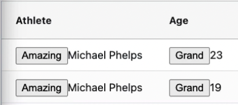

# Vue Components as Cell Renderers

This section will help you get started in customizing the way that cells can render data using Cell Renderers. These are simple Vue components which control how the HTML in a cell is generated and allow formatting and adding extra features like buttons or other functional elements in a cell. In fact anything that you could put in a Vue component you could render into a cell in the grid.

## Tutorial Video

https://youtu.be/ZJga2421b2w

- 00:00 Starting Code
- 00:27 My first component
- 00:45 Rendering Values
- 01:26 Functional Components
- 02:04 Reusing Components
- 02:36 Parameterized Components
- 03:13 Options API Components
- 03:50 Inline Components
- 04:05 Selecting Cell Renderers 
- 05:20 Summary

## Starting Code

In this code w have imported a `h` renderer function to create vnodes, and we have setup the column definitions and row data as `reactive` objects. We also load data from a server using a `fetch` in the `mounted` function.

```javascript
<template>
  <ag-grid-vue
    style="width: 100%; height: 100vh"
    class="ag-theme-alpine"
    :columnDefs="columnDefs.columns"
    :rowData="rowData.rows"
    :defaultColDef="defaultColDef.def"
  >
  </ag-grid-vue>
</template>

<script>
import { AgGridVue } from "ag-grid-vue3";
import { reactive, h } from "vue";


export default {
  name: "App",
  components: {
    AgGridVue,
  },
  setup(props) {
    const columnDefs = reactive({
      columns: [
        { field: "athlete" },
        { field: "age" },
        { field: "country" },
        { field: "year" },
        { field: "date" },
        { field: "sport" },
        { field: "gold" },
        { field: "silver" },
        { field: "bronze" },
        { field: "total" },
      ],
    });

    const defaultColDef = reactive({
      def: { sortable: true, filter: true },
    });
    const rowData = reactive({
      rows: [],
    });

    return { columnDefs, rowData, defaultColDef };
  },

  mounted() {
    fetch(
      "https://www.ag-grid.com/example-assets/olympic-winners.json"
    )
      .then((resp) => resp.json())
      .then((data) => (this.rowData.rows = data));
  },
};
</script>

<style lang="scss">
@import "~ag-grid-community/dist/styles/ag-grid.css";
@import "~ag-grid-community/dist/styles/ag-theme-alpine.css";
</style>

```

## My First Component

To demonstrate that a cell renderer component is just a simple Vue component we will create one that renders "Hello World" in the cell.

In `App.vue` we create a component object called `SimpleComp`:

```javascript
const SimpleComp = {
    setup(props) {
    return () => h("span", "Hello World");
    },
};
```

Then we need to register the component by adding it to the list of components:

```javascript
export default {
  name: "App",
  components: {
    AgGridVue,
    SimpleComp
  }
```    

We can then add the component to a column as a cellRenderer:

```javascript
        { field: "athlete", cellRenderer: "SimpleComp" },
```

The `cellRenderer` will handle how the contents of the cell are displayed, so now every value in the `Athlete` column will render as `Hello World` in a `span` element.

## Rendering Values

The `props` that are passed into the component cell renderer provides access to the grid apis, the value of the cell and all the values and definitions of the cells in the row.

The properties are all documented in the AG Grid documentation:

https://www.ag-grid.com/vue-data-grid/component-cell-renderer/#reference-ICellRendererParams

The `value` property is the underlying value for the cell, we can use this to render the actual value of cell on the screen.


```javascript
const SimpleComp = {
    setup(props) {
    return () => h("span", params.value);
    },
};
```

At this point we have recreated the default cell renderer, and we can now build on this to create a custom cell renderer that adds value.

## Functional Components

Our Cell Renderers return HTML so we can use this to add functionality inside the cell e.g. buttons.

The code below in `FunComp.vue` is a Cell Renderer which will render two buttons followed by the value of the cell. The buttons `[£]` and `[$]` both trigger an alert.

```javascript
<template>
  <div>
    <button @click="alertClick('£')">£</button>
    <button @click="alertClick('$')">$</button>
    <span>{{ value }}</span>
  </div>
</template>

<script>
export default {
  setup(props) {
    let { value } = props.params;
    function alertClick(s) {
      alert(s + s + s + s + " from " + value);
    }
    return { value, alertClick };
  },
};
</script>

<style lang="scss" scoped></style>
```

We import the component into our `App.vue`:

```javascript
<script>
import { AgGridVue } from "ag-grid-vue3";
import { reactive, h } from "vue";
import FunCompVue from "./components/FunComp.vue";
```

Register it for use by adding it to the `components`:

```javascript
export default {
  name: "App",
  components: {
    AgGridVue,
    SimpleComp,
    FunCompVue,
  },
```

And then we can use it on a field:


```javascript
        { field: "athlete", cellRenderer: "FunCompVue" },
```

## Reusing Components

Cell Renderers can easily be used on multiple columns:

```javascript
        { field: "athlete", cellRenderer: "FunCompVue" },
        { field: "age", cellRenderer: "FunCompVue" },
```

We can even assign the Cell Renderer on the default column definition to have it used for all columns:

```javascript
    const defaultColDef = reactive({
      def: {
        sortable: true,
        filter: true,
        cellRenderer: "FunCompVue",
      },
    });
```

If we do add a Cell Renderer on a `defaultColDef` then any individual column can override the definition to use a different renderer or even the default renderer.

To use a default renderer as the override we would use `null` as the `cellRenderer`:

```javascript
        { field: "athlete", cellRenderer: null },
```

## Parameterized Components

We can make components more useful for re-use by passing some configuration parameters to the component.

For example we could set the text of the button by passing in the button text as a parameter:

```javascript
        {
          field: "athlete",
          cellRenderer: "FunCompVue",
          cellRendererParams: { btnText: "Amazing"},
        },
        {
          field: "age",
          cellRenderer: "FunCompVue",
          cellRendererParams: { btnText: "Grand"},
        },
```

Then we can amend `FunComp.vue` to use the parameter we just passed in:

Store the `btnText` passed in from the `props.params`

```
    let {btnText} = props.params
```

Then `return` it to use in the `template`:

```
    return { value, alertClick,btnText };
```

And amend the `template` to render the parameter text as the text in the button:

```javascript
    <button @click="alertClick('£')">{{btnText}}</button>
```


```javascript
<template>
  <div>
    <button @click="alertClick('£')">{{btnText}}</button>
    
    <span>{{ value }}</span>
  </div>
</template>

<script>
export default {
  setup(props) {
    let { value } = props.params;
    let {btnText} = props.params
    function alertClick(s) {
      alert(s + s + s + s + " from " + value);
    }
    return { value, alertClick,btnText };
  },
};
</script>
```

The grid will now use the same component in two cells and each cell will render the button differently because we are passing in the text to display in the button:



## Options API Components

The previous `FunComp.vue` uses the Composition API, we can also use the Options API to create components, as demonstrated below in the code from `OptionsComp.vue`

```javascript
<template>
    <div>
    <button @click="onClick">Pull</button>
    {{value}}
    </div>
</template>

<script>
export default {
    data() {
        return {
            value:''
        };
    },
    beforeMount(){
        this.value = this.params.value
    },
    methods:{
        onClick(){
            alert('The Age Is ' + this.value)
        }
    }
};
</script>

<style lang="scss" scoped></style>
```

This would be used in the column definitions the same way:

```javascript
        {
          field: "age",
          cellRenderer: "OptionsCompVue",
        },
```

And we would have to remember to import it, and add it to our components list.

```javascript
import OptionsCompVue from "./components/OptionsComp.vue";
```

```javascript
  components: {
    AgGridVue,
    SimpleComp,
    FunCompVue,
    OptionsCompVue,
  },
```

We recommend registering components rather than direct component referencing.

## Inline Components

It is possible to inline components as part of the registration process if we want to create quick prototypes.

For example, we could replicate our `SimpleComp` as an inline component:

```javascript
export default {
  name: "App",
  components: {
    AgGridVue,
    SimpleComp: {
      setup(props) {
        const { params } = props;
        return () => h("b", "! " + params.value + " !");
      },
    },
    FunCompVue,
    OptionsCompVue,
  },
```

Then use the component as normal:

```javascript
        { field: "country", cellRenderer: "SimpleComp" },
```

## Selecting Cell Renderers

It can be sometimes useful to use different Cell Renderers for different values in the cell. e.g. if a value is over a specific amount then have a different cell renderer.

In practice this looks like the code below using a `cellRendererSelector`:

```javascript
        {
          field: "year",
          cellRendererSelector: (p) => {
            if (p.value === 2000) {
              return {
                component: "FunCompVue",
                params: {},
              };
            }
            if (p.value === 2008) {
              return {
                component: "OptionsCompVue",
                params: {},
              };
            }
          },
        },
```

Here the `year` field has a `cellRendererSelector` this takes the same parameters as the Cell Renderer so it is possible to have complex logic and functionality in this selector.

In this code are are returning a `FunCompVue` Cell Renderer if the value of the cell is less equal to 2000, and an `OptionsCompVue` Cell Renderer if the value of the cell equals 2008. If neither selection matches then the default cell renderer will be used.

It is possible to pass parameters to the returned Cell Renderers, as we saw before when we used `cellRendererParams` e.g.

```javascript
    return { component: OptionsCompVue, params: {}};
```

Any embedded `params` will be used instead of the `cellRendererParams`.

## Summary

You have seen multiple ways to create components for Cell Renderers in Vue.

- Composition API components
- Options API components
- inline components

You also saw how to choose between cell renderers and pass parameters to the cell renderers.

Cell Renderers are a core customization mechanism for AG Grid and you can find more details in the documentation:

https://www.ag-grid.com/vue-data-grid/component-cell-renderer/